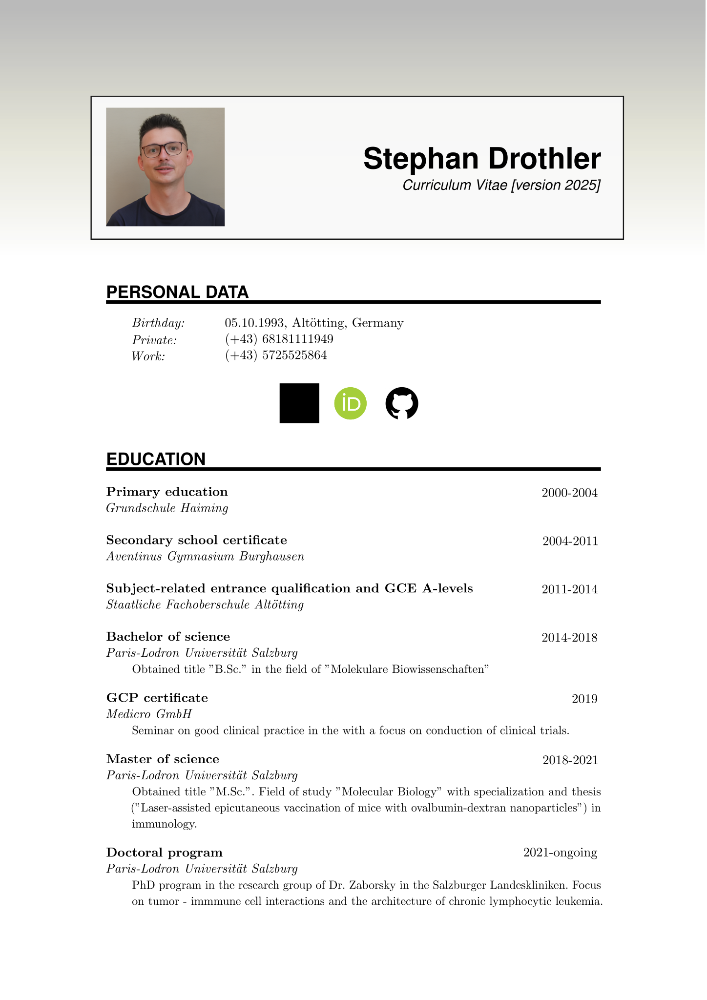
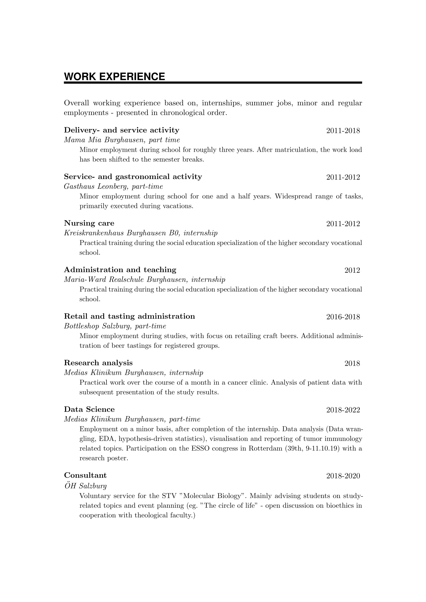
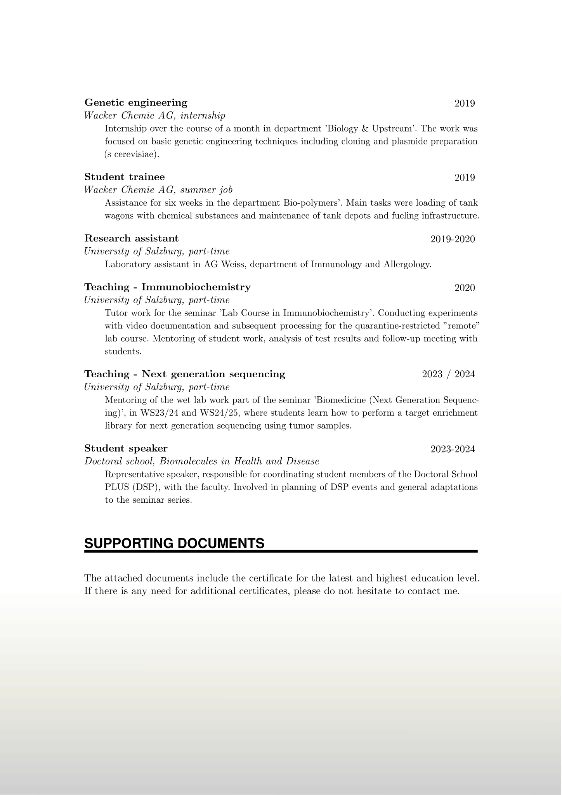

# Public documents

Mostly documents generated during lab courses of the study program ["Molecular biology" at PLUS.](https://www.plus.ac.at/studium/studienangebot/masterstudien/molecular-biology/?lang=en "Study Website")

(Maintained) version of master thesis[^readme-1] and CV.

[^readme-1]: references are screwed somehow, will maybe addressed in the future if there is time

